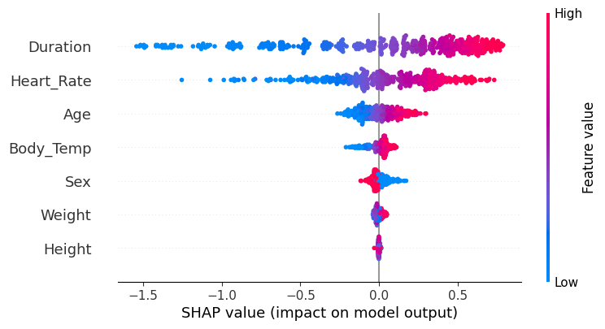
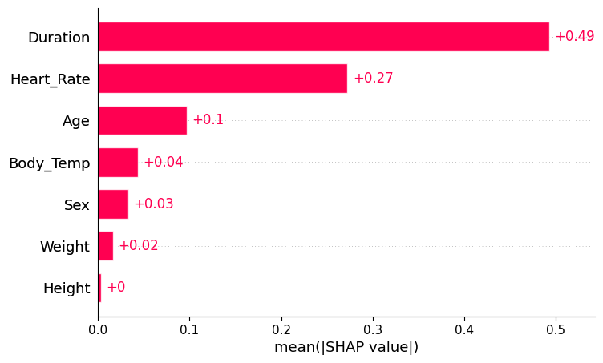

# Calorie Expenditure Prediction – Kaggle Playground Series S5E5

[](https://github.com/Poulami-Nandi)

Welcome! This repository provides a full machine learning pipeline for solving the [Kaggle Playground Series - Season 5, Episode 5](https://www.kaggle.com/competitions/playground-series-s5e5) challenge. The objective is to accurately predict **calorie expenditure** based on a set of physiological attributes and activity metrics.

---

## 📌 Problem Statement

Given a dataset containing features such as:
- Age, Sex, Height, Weight
- Duration of exercise, Heart Rate, Body Temperature

The task is to predict the total **calories burned**, a continuous target variable.

---

## 📁 Project Structure

```
├── data/
│   ├── train.csv
│   ├── test.csv
│   └── sample_submission.csv
├── notebooks/
│   └── eda_model_shap.ipynb         # End-to-end solution: EDA → ML → SHAP → Submission
├── outputs/
│   └── submission.csv               # Final predictions for Kaggle
├── images/
│   ├── shap_summary.png
│   └── shap_bar.png
├── README.md
└── requirements.txt
```

---

## 🚀 Highlights

- 📊 **Exploratory Data Analysis (EDA)** with distribution plots, boxplots, and correlation matrix
- 🧹 **Data Preprocessing** including label encoding, log transformation, and feature scaling
- 🔁 **Cross-validation** using K-Fold strategy (configurable)
- 🔧 **Baseline Models**: Linear Regression, Random Forest, XGBoost
- 🧪 **Hyperparameter Tuning** with `GridSearchCV`
- 📤 **Prediction & Submission** pipeline (submission.csv ready)
- 🧠 **Model Explainability** via SHAP summary and force plots
- 📸 **Static image exports** of SHAP for GitHub and reporting

---

## 📈 Cross-Validation RMSE Results

| Model             | CV RMSE (log target) |
|------------------|----------------------|
| Linear Regression| ~52.3                |
| Random Forest    | ~40.7                |
| XGBoost (Tuned)  | ~38.5 ✅             |

> *Note: Results may vary depending on train/validation split and random seeds.*

---

## 📊 SHAP Visualization (Feature Importance)

**Summary Plot**  


**Bar Plot**  


These plots highlight the impact of each feature on the model's predictions. Features like `Duration`, `Heart_Rate`, and `Body_Temp` emerged as the most influential.

---

## ⚙️ Setup Instructions

Install required Python packages:

```bash
pip install -r requirements.txt
```

---

## 📤 Submission Format

Output file: `outputs/submission.csv`

```
id,Calories
750000,88.11
750001,123.04
...
```

Upload this file to the Kaggle competition page to receive your score.

---

## Future Improvements

- Ensemble multiple XGBoost/LightGBM models
- Neural network regression baseline with dropout
- Outlier removal for physiological extremes
- Advanced feature engineering: BMI, HR/Weight ratios
- SHAP DeepExplainer if neural nets are used

---

## 👩‍💻 Author

**Dr. Poulami Nandi**  
   
Postdoctoral Researcher | Machine Learning Engineer | Quantitative Analyst  
📍 Based in USA | UPenn, Ex-IIT Kanpur, IIT GN, TU Wien, UC Davis  
[University of Pennsylvania](https://live-sas-physics.pantheon.sas.upenn.edu/people/poulami-nandi) | [IIT Kanpur](https://www.iitk.ac.in/) | [TU Wien](http://www.itp.tuwien.ac.at/CPT/index.htm?date=201838&cats=xbrbknmztwd)
📧 [nandi.poulami91@gmail.com](mailto:nandi.poulami91@gmail.com), [pnandi@sas.upenn.edu](mailto:pnandi@sas.upenn.edu)  
🔗 [LinkedIn](https://www.linkedin.com/in/poulami-nandi-a8a12917b/) • [GitHub](https://github.com/Poulami-Nandi) • [Google Scholar](https://scholar.google.co.in/citations?user=bOYJeAYAAAAJ&hl=en) • [Kaggle](https://www.kaggle.com/poulaminandi91) 

---

## 📜 License

This project is released under the **MIT License**. See the [LICENSE](LICENSE) file for more details.

---

## 🌟 If you like this project...

Feel free to ⭐ star the repo, fork it, or reach out with ideas and collaborations! Happy modeling!
